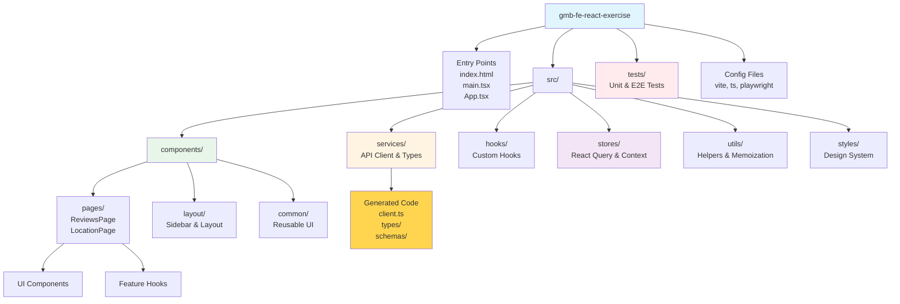

# Architecture Diagram

```mermaid
graph TB
    Root[gmb-fe-react-exercise]

    Root --> Entry[Entry Points<br/>index.html<br/>main.tsx<br/>App.tsx]
    Root --> Src[src/]
    Root --> Tests[tests/<br/>Unit & E2E Tests]
    Root --> Config[Config Files<br/>vite, ts, playwright]

    Src --> Components[components/]
    Src --> Services[services/<br/>API Client & Types]
    Src --> Hooks[hooks/<br/>Custom Hooks]
    Src --> Stores[stores/<br/>React Query & Context]
    Src --> Utils[utils/<br/>Helpers & Memoization]
    Src --> StylesDir[styles/<br/>Design System]

    Components --> Pages[pages/<br/>ReviewsPage<br/>LocationPage]
    Components --> Layout[layout/<br/>Sidebar & Layout]
    Components --> Common[common/<br/>Reusable UI]

    Services --> Generated[Generated Code<br/>client.ts<br/>types/<br/>schemas/]

    Pages --> UI[UI Components]
    Pages --> PageHooks[Feature Hooks]

    style Root fill:#e1f5ff
    style Services fill:#fff4e1
    style Components fill:#e8f5e9
    style Stores fill:#f3e5f5
    style Tests fill:#ffebee
    style Generated fill:#ffd54f
```